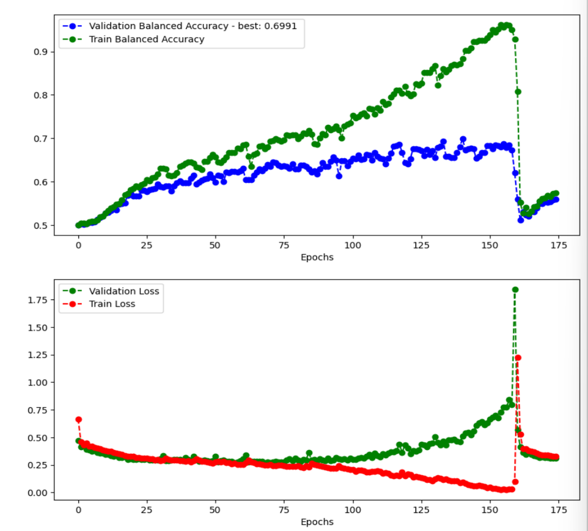
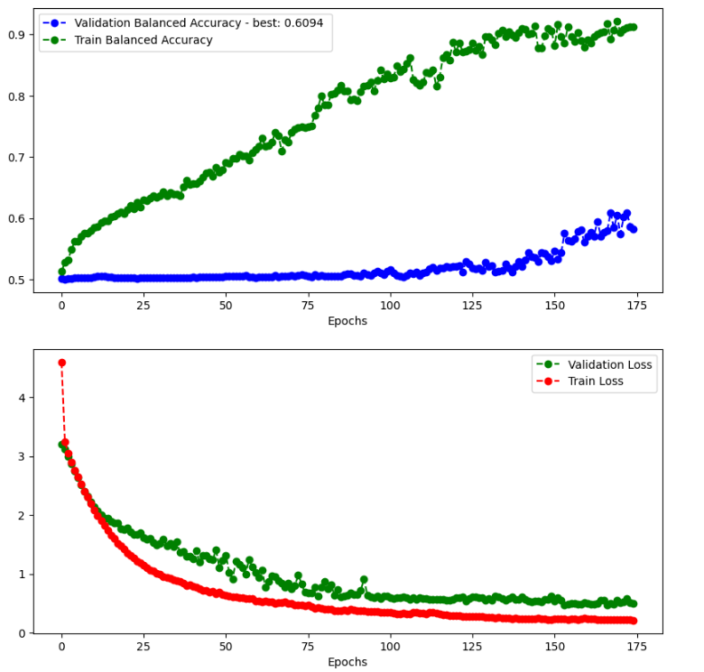
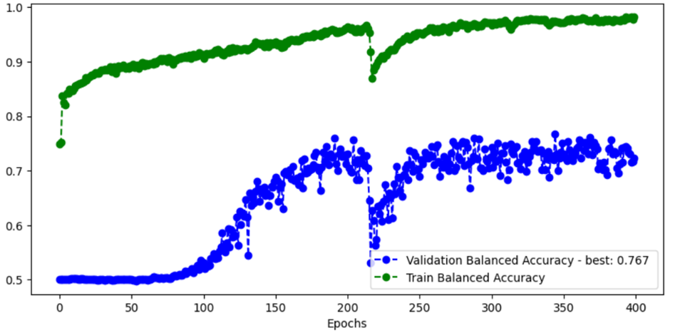
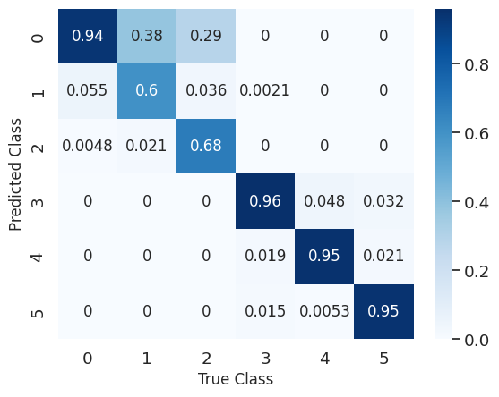

# Machine Learning Project 

This project explores several core Machine Learning (ML) concepts through four main tasks, using the Keras and Scikit-Learn libraries in Python. It is divided into two parts: **regression with synthetic data** and **image classification with real-world data**. Along the way, various techniques were applied, including regularization methods (Lasso, Ridge, Dropout), clustering algorithms (K-Means, GMM), data augmentation, and model ensembling.

The full project report with all conclusions and tested methods, as well as all python code (Jupyter Notebooks), can be found in this repository.

---

##  Key Concepts Covered

- **Linear Regression** – Modeling a linear relationship between features and target.
- **Regularization** – Techniques like **Lasso** and **Ridge** to reduce overfitting and improve generalization.
- **Overfitting** – When a model fits training data too closely and fails to generalize to unseen data.
- **Cross-validation (k-fold)** – Evaluating model performance over different subsets of data.
- **Learning Rate Scheduling** – Adjusting the learning rate over time to enhance training.
- **Clustering** – Unsupervised grouping of data (K-means, Gaussian Mixture Models).
- **Convolutional Neural Networks (CNNs)** – Used for image classification tasks.
- **Class Imbalance** – Handled with **class weights** and **oversampling with data augmentation**.
- **Model Ensemble** – Combining multiple CNNs for improved classification performance.
- **Balanced Accuracy** – Average of per-class accuracy; accounts for class imbalance.

---

## Part 1 – Regression with Synthetic Data
This part was trained with Scikit-Learn librart in Python.
### Task 4.1: Linear Regression with Few Training Samples

Given only 15 training samples with 10 features each, linear regression was prone to overfitting. Various regularization techniques were explored:

- **Lasso Regression** reduces model complexity by chosing irrelevant coefficients and setting them to zero.
- **Ridge Regression** helped shrink coefficient magnitudes and control variance.
- **Best Strategy:** Combine **Lasso** for feature selection and **Ridge** for weight selections. This achieved the best NMSE.

**Results on Train Data (NMSE with Cross-validation):**

| Model               | NMSE   |
|--------------------|--------|
| Lasso + Ridge      | -1.45  |
| Lasso              | -2.04  |
| Ridge              | -2.18  |
| No Regularization  | -30.80 |

**Test Data NMSE**: -1.86

---

### Task 4.2: Clustering + Regression

The train and test data were generated with **two unknown linear models** and mixed in order. To solve this, we:

1. Applied **K-Means** and **Gaussian Mixture Models (GMM)** to separate the training data.
2. Trained **Ridge Regression** separately on each cluster to aproaximate each of the linear models. Ridge regularization was chosen due to few features for each data sample.

**Best Model**: GMM + Ridge Regression

| Clustering Method | NMSE (Model 1 / 2) | R² (Model 1 / 2) |
|-------------------|--------------------|------------------|
| GMM               | -0.053 / -0.038    | 0.971 / 0.980    |
| K-Means           | -0.665 / -0.532    | 0.260 / 0.195    |

**Test Data NMSE**: -0.0481

---

## Part 2 – Image Classification with CNNs
Data augmentation was done with Keras' ImageDataGenerator.

Training and classifying was done with Scikit-Learn.

### Task 5.1: Binary Classification – Melanoma vs Nevus

**Challenges:**
- Imbalanced dataset (melanoma: ~14%, nevus: ~86%)
- Overfitting due to small data size

**Solutions:**
- Added **Dropout**, **Batch Normalization**, **Kernel & Bias Regularization**
- Tried **Class Weights** and **Oversampling via Data Augmentation**
- Used **Balanced Accuracy** and **Confusion Matrix** for evaluation
- Tested different **batch sizes** and found that **2048** worked best
- **Shuffling the data** significantly improved performance

Below are the training and validation accuracy/loss graphs that illustrate the progressive improvements made throughout the model development pipeline.

**Baseline Model – Imbalanced Data, No Regularization**

Original CNN trained with imbalanced data and no regularization. This served as the initial baseline, revealing overfitting and poor generalization.

  

**Improved Model – Class Weights and Regularization**

Enhancements made by introducing **class weighting** to address imbalance and adding **regularization**. The training became more stable, with noticeable performance gains on the validation set.

  

**Final Model - Test dataset Balanced Accuracy: 0.781**

The final version of the model after architecture and training strategy optimizations. This model demonstrates strong generalization and balanced performance.

Results were overall not great. These were improved with Task 5.2, where a less complex CNN arqitecture was used (mainly by decreasing number ans size of fully conected layers) and by focusing more on **Dropout** regularization.

  

---

### Task 5.2: Multi-class Classification (6 Classes)

  

**Further Improvements:**
- Reduced batch size to **256** after testing multiple values
- Optimized CNN architecture to reduce overfitting
- Introduced **Learning Rate Scheduling**:
  

  

---
### Authors

- Alexandre Reis
- Rodolfo Amorin

